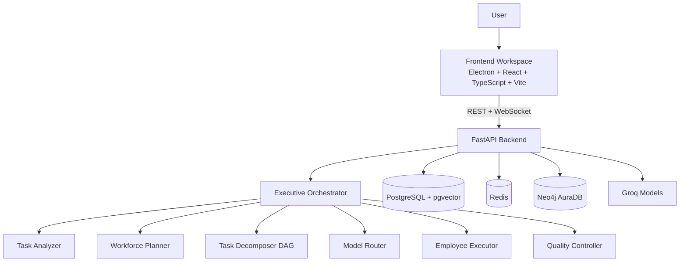

# 🤖 Naukar — Autonomous AI Workforce Platform

> Give a task. We hire the team. We do the work. You get the result.

---

## What is Naukar?

Naukar is a production-grade **Autonomous AI Workforce Platform**. You provide only a task — the system decides everything else:

- What needs to be done
- Which skills are required
- How many workers are needed
- Which models each worker uses
- How workers collaborate (sequential, parallel, hierarchical)
- Whether the output meets quality standards
- When to retry, escalate, or fix issues

## Quick Start

### Prerequisites
- Docker Desktop (running)
- Python 3.11+
- Node.js 18+ (Corepack included)
- Yarn 4.9.2 (managed via Corepack)
- Groq API key
- Neo4j AuraDB instance (optional for Phase 1)

### 1. Enable Yarn (Corepack)

```powershell
# From project root
corepack prepare yarn@4.9.2 --activate
"C:\Program Files\nodejs\corepack.cmd" yarn --version
```

### 2. Install Dependencies (Monorepo)

```powershell
# From project root
"C:\Program Files\nodejs\corepack.cmd" yarn install
```

### 3. Configure Backend Environment

```powershell
cd backend
cp .env.example .env
# Edit .env — add your GROQ_API_KEY, NEO4J credentials
```

### 4. Start Infrastructure

```powershell
# From project root
docker compose up -d
```

### 5. Start Backend

```powershell
cd backend
python -m venv .venv
.venv\Scripts\activate
pip install -r requirements.txt
python -m uvicorn main:app --reload --host 0.0.0.0 --port 8000
```

### 6. Start Frontend

```powershell
"C:\Program Files\nodejs\corepack.cmd" yarn dev:web
```

Optional Electron mode:

```powershell
"C:\Program Files\nodejs\corepack.cmd" yarn dev:frontend
```

### Or use the startup script:

```powershell
.\start.ps1
```

## Monorepo Commands

Run from project root.

```powershell
# Frontend web mode
"C:\Program Files\nodejs\corepack.cmd" yarn dev:web

# Frontend (Electron + Vite)
"C:\Program Files\nodejs\corepack.cmd" yarn dev:frontend

# Backend
"C:\Program Files\nodejs\corepack.cmd" yarn dev:backend

# Build frontend
"C:\Program Files\nodejs\corepack.cmd" yarn build

# Type-check frontend
"C:\Program Files\nodejs\corepack.cmd" yarn typecheck

# Backend tests
cd backend
pytest -q
```

---

## Architecture

### System Diagram



### Monorepo Layout

```text
Naukar/
├── package.json              # Yarn workspaces (frontend, backend)
├── yarn.lock                 # Single lockfile for monorepo
├── start.ps1                 # One-command startup (docker + backend + frontend web)
├── backend/                  # FastAPI service and orchestration engine
└── frontend/                 # Electron + React client
```

```
┌─────────────────────────────────────────────────────────┐
│                    Electron Frontend                     │
│  React · TypeScript · Zustand · WebSocket               │
└─────────────────────┬───────────────────────────────────┘
                      │ REST + WebSocket
┌─────────────────────▼───────────────────────────────────┐
│                  FastAPI Backend                         │
│                                                          │
│  ExecutiveOrchestrator (autonomous loop)                 │
│    ├── TaskIntelligenceEngine                           │
│    ├── ComplexityAnalyzer                               │
│    ├── WorkforcePlanner (LLM-driven)                    │
│    ├── EmployeeFactory                                  │
│    ├── TaskDecomposer (DAG)                             │
│    ├── DynamicModelRouter (cascade)                     │
│    ├── EmployeeExecutor                                 │
│    └── QualityController                               │
└───┬──────────┬──────────┬──────────────────────────────┘
    │          │          │
PostgreSQL  AuraDB     Redis
+pgvector  (Neo4j)  (Events/Cache)
```

## Tech Stack

| Layer | Technology |
|-------|-----------|
| Frontend | Electron + React + TypeScript + Vite |
| Backend | Python FastAPI + Pydantic v2 |
| Primary DB | PostgreSQL + SQLAlchemy async |
| Vector Store | pgvector (RAG embeddings) |
| Graph DB | Neo4j AuraDB (workforce graph) |
| Cache/Events | Redis Pub/Sub |
| LLM | Groq (compound-beta, compound-beta-mini) |
| Real-time | WebSocket (native FastAPI) |

## How it works

```
User: "Create a competitor analysis for my SaaS"

System:
1. 🔍 Analyzes the task → type: Research+Analysis, complexity: 0.72
2. 👥 Designs workforce → Project Manager + 4 specialists + Reviewer
3. 🤖 Creates employees → each with role, skills, tools, quality target
4. 📋 Decomposes work → 6-step DAG
5. ⚡ Selects models → compound-mini for research, compound for analysis
6. 🔎 Executes + QC → each step quality-gated, retry on fail
7. ✅ Synthesizes → professional final report delivered
```

## Project Structure

```
Naukar/
├── docker-compose.yml       # Infrastructure
├── start.ps1                # Startup script
├── backend/
│   ├── main.py              # FastAPI entry
│   ├── requirements.txt
│   ├── .env                 # Your secrets
│   └── app/
│       ├── core/            # Config, DB, Events
│       ├── orchestrator/    # Main loop + Task analyzer
│       ├── workforce/       # Planner + Factory
│       ├── tasks/           # Models + Decomposer
│       ├── router/          # Model router
│       ├── employees/       # Executor
│       ├── evaluation/      # Quality controller
│       ├── llm/             # Provider abstraction + Groq
│       ├── api/             # REST + WebSocket
│       └── db/              # SQLAlchemy ORM
└── frontend/
    ├── electron/            # Electron main process
    └── src/
        ├── store/           # Zustand state
        ├── components/      # React UI
        └── index.css        # Design system
```

---

## Phase 2 Roadmap

- [ ] Parallel step execution
- [ ] Real web search + browser tools (SerpAPI, Playwright)
- [ ] RAG: PDF/DOCX ingestion + pgvector retrieval
- [ ] Dynamic workforce modification during execution
- [ ] Historical model performance learning
- [ ] Task cost tracking + budget enforcement
- [ ] Human approval gates for high-risk actions
- [ ] Analytics dashboard
